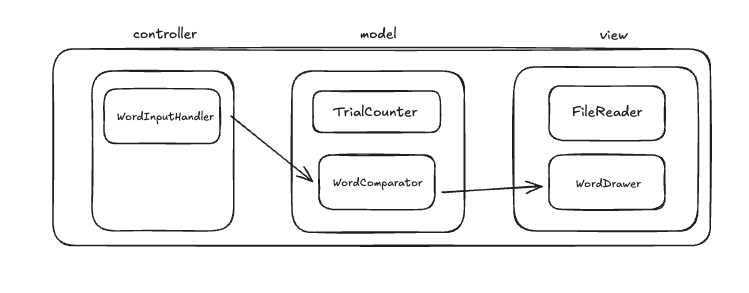

## 기능 목록

[] 출력
- [x] 정답과 답안은 `words.txt`에 존재하는 단어여야 한다. 
- [x] 정답은 매일 바뀌며 ((현재 날짜 - 2021년 6월 19일) % 배열의 크기) 번째의 단어이다.
    - [x] 텍스트 파일에서 한 단어를 읽는다.
    - [x] 오늘의 단어를 선택한다. ((현재 날짜 - 2021년 6월 19일) % 배열의 크기)

[x] 입력 
  - [x] 6x5 격자를 통해서 5글자 단어를 6번 만에 추측한다.
  - [x] 최대 6번 단어를 입력받는다.
  - [] 입력받은 단어는 소문자로 표기한다.
  - [x] 시도
      - [x] 글자와 위치 모두 같을 때 초록색으로 표시한다.
      - [x] 글자의 위치가 다를 때 노란색으로 표시한다.
      - [x] 불일치할 경우 회색으로 표시한다.
    - [x] 각 시도마다 시도 가능 횟수가 차감된다.
  - [x] 성공
    - [x] 5개 글자 모두 일치할 경우 성공한다.
  - [x] 실패
    - [x] 시도 가능 횟수가 0이 되면 실패한다.  

[x] 플레이어가 답안을 제출하면 프로그램이 정답과 제출된 단어의 각 알파벳 종류와 위치를 비교해 판별한다.
  - 1. [x] 부분 일치
  1. [x] 글자가 같고 위치가 다를 때 부분 일치라고 한다.
  - 2. [x] 완전 일치
  1. [x] 글자와 위치가 모두 같을 때, 완전 일치라고 한다.
  - 3. [x] 글자 비교기
  1. [x] 글자 비교기를 통해, 부분일치와 완전 일치를 판단한다.
     1. [x] 기본적으로 불일치로 판단한다. 
     2. [x] 완전일치 판단 방법:
        1. 입력 단어와 정답 단어를 입력받는다.
        2. 글자 하나하나를 순서대로 반복문을 통해 비교한다.
        3. 같은 글자이면, 완전일치로 판단한다.
     3. [x] 부분일치 판단 방법:
        1. 정답단어의 글자를 key, 나타난 횟수를 value로 map 에 저장한다.
        2. 입력 단어의 글자를 반복문을 통해, 맵에 포함되어 있는지 확인한다.
        3. 입력 단어의 글자가 맵에 포함되어 있으면, 맵에서 해당 글자의 밸류를 차감하고, 부분일치로 판단한다.

[x] 출력
    - [x] 일치 판단 결과에 따라 색깔을 출력한다.
        - [x] 모든 칸들을 회색으로 출력한다.
        - [x] 부분 일치 먼저, 노란색으로 출력한다.
        - [x] 이후 완전 일치를 초록색으로 출력한다.

## 구상도

